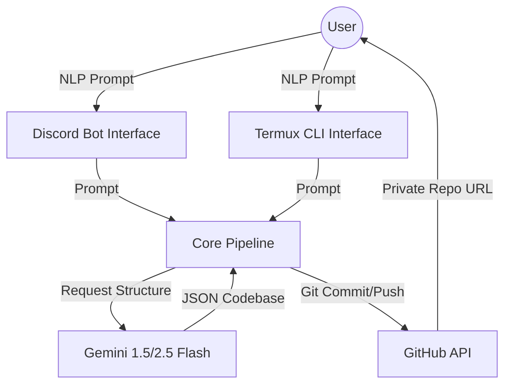

# Turmux Vibe Technical Documentation

## Architecture Overview

Turmux Vibe is an automated application generation and deployment system. It bridges the gap between natural language requirements and fully-hosted, version-controlled code.

### High-Level Diagrams

## Component Breakdown

### 1. Configuration Module (`config.py`)
- **Purpose**: Centralized management of API keys and environment variables.
- **Logic**: Uses `python-dotenv` to load secrets from a local `.env` file. Validates required keys before any operation.

### 2. Gemini Client (`core/gemini_client.py`)
- **Intelligence**: Wraps `google-generativeai`.
- **System Prompting**: Employs a rigorous system prompt to ensure results are returned in a parseable JSON schema.
- **Resilience**: Implements exponential backoff retry logic to handle Gemini API rate limits (`429` errors) gracefully.

### 3. Application Generator (`core/app_generator.py`)
- **Transformation**: Converts raw LLM JSON into a structured `AppBundle`.
- **Boilerplate Injection**: Automatically injects critical files like `.gitignore`, `Dockerfile`, `README.md`, and `TECHNICAL_DOCS.md` into every generated project if Gemini misses them.

### 4. GitHub Pusher (`core/github_pusher.py`)
- **Direct Integration**: Uses the GitHub REST API (via `PyGithub`) to create private repositories.
- **Speed**: Pushes files directly via the Contents API, avoiding the need for high-overhead local `git init`/`commit` commands, which is critical for performance on mobile devices (Termux).

### 5. Interaction Layers
- **Discord Bot (`discord_bot/bot.py`)**: Asynchronous bot using `discord.py` slash commands. Provides real-time progress feedback via embeds.
- **CLI (`cli/build.py`)**: Synchronous script for terminal use, supporting interactive multi-line prompts.

## Deployment Strategies

### Local Execution (Ephemeral)
- Standard Python environment execution. Perfect for debugging.

### Mobile Execution (Termux)
- Leverages `nohup` for persistent background execution on Android.
- `termux_setup.sh` automates the complex package setup (Python, Git, environment).

### Cloud Execution (Fly.io)
- Containerized using the provided `Dockerfile`.
- Deployed as a "worker" machine (no public HTTP port needed for bot gateway).

## Security Model

- **Zero-Secret Commits**: `.env` is globally ignored.
- **Private-First**: Every repository created is explicitly set to `private=True` via the GitHub API.
- **User-Owned**: Code is pushed to the *user's* account, ensuring they retain 100% control over the generated IP.
